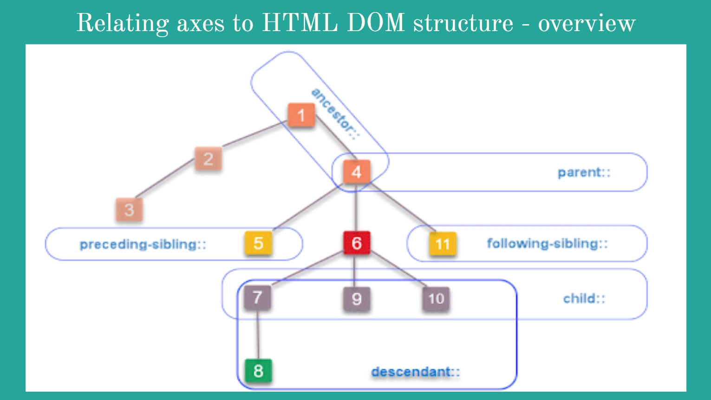

# Xpath-Overview

---
#### Details: 
* Created By: <b>Sarang Holey</b>
* Date: March-2021
* This repository contain an brief overview about xpath basics and xpath axes.
  * Topics covred - 
       * What is Xpath
       * Where to Use Xpath
       * Types of Xpath
       * Which Xpath statagy should be used
       * Xpath with some different fuctions
       * Xpath axes
              
---

>

---

>

---

>

---

>

---

>

---

>

---

>

---

>

---

>

---

>

---

>

---

>

---